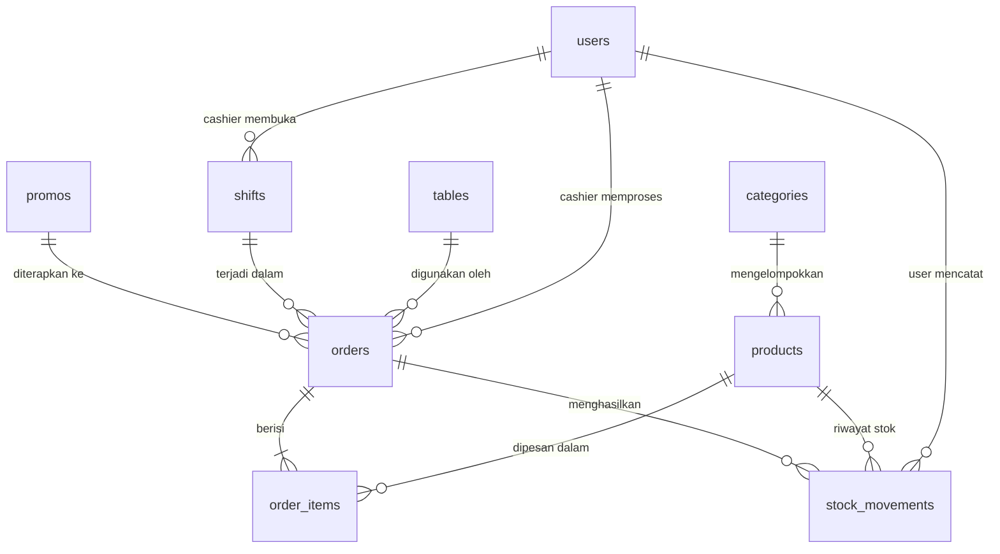

# Desain Database — CoffeePOS

Dokumen ini menjelaskan desain database MySQL untuk sistem CoffeePOS berdasarkan [PRD.md](file:///home/djangkrik/Gambar/belajar_golang/PRD.md).

| Field          | Detail                          |
|----------------|---------------------------------|
| **DBMS**       | MySQL 8.0+                      |
| **Charset**    | utf8mb4                         |
| **Collation**  | utf8mb4_unicode_ci              |
| **Engine**     | InnoDB                          |

---

## 1. Ringkasan Tabel

| No | Tabel              | Deskripsi                                                        | Soft Delete |
|----|--------------------|------------------------------------------------------------------|:-----------:|
| 1  | `users`            | Akun pengguna (Owner & Cashier)                                  | ✅          |
| 2  | `categories`       | Kategori produk (Kopi, Non-Kopi, Makanan, dll.)                  | ❌          |
| 3  | `products`         | Produk yang dijual beserta stok saat ini                         | ✅          |
| 4  | `stock_movements`  | Log riwayat setiap pergerakan stok                               | ❌          |
| 5  | `tables`           | Daftar meja di coffee shop                                       | ❌          |
| 6  | `shifts`           | Data shift kasir (buka/tutup, modal kas, rekap)                  | ❌          |
| 7  | `promos`           | Promo dan diskon yang bisa diaplikasikan ke transaksi            | ✅          |
| 8  | `orders`           | Header transaksi (order) pelanggan                               | ❌          |
| 9  | `order_items`      | Detail item dalam setiap order                                   | ❌          |

---

## 2. Struktur Tabel

### 2.1 `users`

Menyimpan data akun Owner dan Cashier. Soft delete digunakan agar data transaksi historis tetap berintegritas.

| Kolom        | Tipe Data                       | Constraint                    | Keterangan                                      |
|--------------|---------------------------------|-------------------------------|-------------------------------------------------|
| `id`         | `VARCHAR(36)`                   | `PRIMARY KEY`                 | UUID v4                                         |
| `name`       | `VARCHAR(100)`                  | `NOT NULL`                    | Nama lengkap pengguna                           |
| `email`      | `VARCHAR(255)`                  | `NOT NULL`, `UNIQUE`          | Email untuk login; harus unik                   |
| `password`   | `VARCHAR(255)`                  | `NOT NULL`                    | Password di-hash dengan bcrypt                  |
| `role`       | `ENUM('owner','cashier')`       | `NOT NULL`                    | Role menentukan hak akses                       |
| `is_active`  | `TINYINT(1)`                    | `NOT NULL`, `DEFAULT 1`      | `1` = aktif, `0` = nonaktif; nonaktif tidak bisa login |
| `created_at` | `TIMESTAMP`                     | `NOT NULL`, `DEFAULT CURRENT_TIMESTAMP` | Waktu pembuatan akun              |
| `updated_at` | `TIMESTAMP`                     | `NOT NULL`, `DEFAULT CURRENT_TIMESTAMP ON UPDATE CURRENT_TIMESTAMP` | Waktu update terakhir |
| `deleted_at` | `TIMESTAMP`                     | `NULL`, `DEFAULT NULL`        | Soft delete; jika terisi, akun dianggap dihapus |

**Index:**

| Nama Index             | Kolom(s)              | Tipe     | Alasan                                    |
|------------------------|-----------------------|----------|-------------------------------------------|
| `idx_users_email`      | `email`               | `UNIQUE` | Lookup cepat saat login                   |
| `idx_users_role`       | `role`                | `INDEX`  | Filter user berdasarkan role              |

---

### 2.2 `categories`

Mengelompokkan produk ke dalam kategori. Tidak menggunakan soft delete — kategori hanya bisa dihapus jika tidak ada produk aktif terkait (Business Rule #17).

| Kolom        | Tipe Data                       | Constraint                    | Keterangan                                      |
|--------------|---------------------------------|-------------------------------|-------------------------------------------------|
| `id`         | `VARCHAR(36)`                   | `PRIMARY KEY`                 | UUID v4                                         |
| `name`       | `VARCHAR(100)`                  | `NOT NULL`, `UNIQUE`          | Nama kategori; harus unik                       |
| `created_at` | `TIMESTAMP`                     | `NOT NULL`, `DEFAULT CURRENT_TIMESTAMP` | Waktu pembuatan                   |
| `updated_at` | `TIMESTAMP`                     | `NOT NULL`, `DEFAULT CURRENT_TIMESTAMP ON UPDATE CURRENT_TIMESTAMP` | Waktu update terakhir |

**Index:**

| Nama Index               | Kolom(s)  | Tipe     | Alasan                                |
|--------------------------|-----------|----------|---------------------------------------|
| `idx_categories_name`    | `name`    | `UNIQUE` | Enforced uniqueness + lookup by name  |

---

### 2.3 `products`

Menyimpan data produk beserta stok saat ini. Menggunakan soft delete agar data order historis tetap bisa mereferensi produk yang sudah dihapus.

| Kolom         | Tipe Data                       | Constraint                    | Keterangan                                      |
|---------------|---------------------------------|-------------------------------|-------------------------------------------------|
| `id`          | `VARCHAR(36)`                   | `PRIMARY KEY`                 | UUID v4                                         |
| `category_id` | `VARCHAR(36)`                   | `NOT NULL`, `FOREIGN KEY`     | FK → `categories.id`                            |
| `name`        | `VARCHAR(150)`                  | `NOT NULL`, `UNIQUE`          | Nama produk; harus unik                         |
| `description` | `TEXT`                          | `NULL`                        | Deskripsi produk (opsional)                     |
| `price`       | `BIGINT`                        | `NOT NULL`                    | Harga dalam **sen** (Rp 25.000 = `2500000`)     |
| `image_url`   | `VARCHAR(500)`                  | `NULL`                        | Path/URL foto produk (JPG/PNG, maks 2 MB)       |
| `stock`       | `INT`                           | `NOT NULL`, `DEFAULT 0`      | Jumlah stok saat ini; tidak boleh negatif        |
| `is_active`   | `TINYINT(1)`                    | `NOT NULL`, `DEFAULT 1`      | `1` = aktif (tampil di kasir), `0` = nonaktif   |
| `created_at`  | `TIMESTAMP`                     | `NOT NULL`, `DEFAULT CURRENT_TIMESTAMP` | Waktu pembuatan                   |
| `updated_at`  | `TIMESTAMP`                     | `NOT NULL`, `DEFAULT CURRENT_TIMESTAMP ON UPDATE CURRENT_TIMESTAMP` | Waktu update terakhir |
| `deleted_at`  | `TIMESTAMP`                     | `NULL`, `DEFAULT NULL`        | Soft delete; produk yang dihapus tidak tampil di kasir |

**Index:**

| Nama Index                  | Kolom(s)                     | Tipe     | Alasan                                        |
|-----------------------------|------------------------------|----------|-----------------------------------------------|
| `idx_products_name`         | `name`                       | `UNIQUE` | Enforced uniqueness nama produk               |
| `idx_products_category`     | `category_id`                | `INDEX`  | Filter produk berdasarkan kategori            |
| `idx_products_active`       | `is_active`, `deleted_at`    | `INDEX`  | Query kasir: produk aktif & belum dihapus     |

---

### 2.4 `stock_movements`

Log immutable setiap pergerakan stok. Tidak mendukung update atau delete — setiap record merepresentasikan satu event perubahan stok (Business Rule #14).

| Kolom         | Tipe Data                       | Constraint                    | Keterangan                                      |
|---------------|---------------------------------|-------------------------------|-------------------------------------------------|
| `id`          | `VARCHAR(36)`                   | `PRIMARY KEY`                 | UUID v4                                         |
| `product_id`  | `VARCHAR(36)`                   | `NOT NULL`, `FOREIGN KEY`     | FK → `products.id`                              |
| `user_id`     | `VARCHAR(36)`                   | `NOT NULL`, `FOREIGN KEY`     | FK → `users.id`; siapa yang melakukan perubahan |
| `order_id`    | `VARCHAR(36)`                   | `NULL`, `FOREIGN KEY`         | FK → `orders.id`; terisi jika pengurangan dari transaksi yang `paid` |
| `type`        | `ENUM('IN','OUT','ADJUST')`     | `NOT NULL`                    | Tipe pergerakan: masuk, keluar, atau koreksi    |
| `quantity`    | `INT`                           | `NOT NULL`                    | Jumlah perubahan (selalu positif)               |
| `reason`      | `VARCHAR(255)`                  | `NOT NULL`                    | Alasan perubahan (restock, penjualan, koreksi, kerusakan, dll.) |
| `created_at`  | `TIMESTAMP`                     | `NOT NULL`, `DEFAULT CURRENT_TIMESTAMP` | Waktu event terjadi                 |

**Index:**

| Nama Index                     | Kolom(s)                   | Tipe    | Alasan                                        |
|--------------------------------|----------------------------|---------|-----------------------------------------------|
| `idx_stockmov_product`         | `product_id`               | `INDEX` | Riwayat stok per produk                       |
| `idx_stockmov_type`            | `type`                     | `INDEX` | Filter berdasarkan tipe pergerakan            |
| `idx_stockmov_created`         | `created_at`               | `INDEX` | Filter berdasarkan rentang tanggal            |
| `idx_stockmov_order`           | `order_id`                 | `INDEX` | Lookup movement berdasarkan order             |

---

### 2.5 `tables`

Daftar meja fisik di coffee shop. Nama tabel `tables` merupakan reserved word di MySQL — **selalu gunakan backtick** (`` `tables` ``) dalam query.

| Kolom          | Tipe Data                               | Constraint                    | Keterangan                                      |
|----------------|-----------------------------------------|-------------------------------|-------------------------------------------------|
| `id`           | `VARCHAR(36)`                           | `PRIMARY KEY`                 | UUID v4                                         |
| `table_number` | `VARCHAR(20)`                           | `NOT NULL`, `UNIQUE`          | Nomor/nama meja (contoh: "A1", "T-05")          |
| `capacity`     | `INT`                                   | `NOT NULL`, `DEFAULT 4`       | Kapasitas kursi per meja                        |
| `status`       | `ENUM('available','occupied')`          | `NOT NULL`, `DEFAULT 'available'` | Status meja saat ini                        |
| `created_at`   | `TIMESTAMP`                             | `NOT NULL`, `DEFAULT CURRENT_TIMESTAMP` | Waktu pembuatan                   |
| `updated_at`   | `TIMESTAMP`                             | `NOT NULL`, `DEFAULT CURRENT_TIMESTAMP ON UPDATE CURRENT_TIMESTAMP` | Waktu update terakhir |

**Index:**

| Nama Index                | Kolom(s)        | Tipe     | Alasan                                    |
|---------------------------|-----------------|----------|-------------------------------------------|
| `idx_tables_number`       | `table_number`  | `UNIQUE` | Enforced uniqueness + lookup              |
| `idx_tables_status`       | `status`        | `INDEX`  | Filter meja yang tersedia                 |

---

### 2.6 `shifts`

Mencatat data shift kasir. Data shift bersifat **immutable setelah ditutup** (Business Rule #23).

| Kolom                | Tipe Data      | Constraint                    | Keterangan                                      |
|----------------------|----------------|-------------------------------|-------------------------------------------------|
| `id`                 | `VARCHAR(36)`  | `PRIMARY KEY`                 | UUID v4                                         |
| `cashier_id`         | `VARCHAR(36)`  | `NOT NULL`, `FOREIGN KEY`     | FK → `users.id`; cashier pemilik shift          |
| `opening_cash`       | `BIGINT`       | `NOT NULL`                    | Modal kas awal dalam **sen**; harus > 0         |
| `closing_cash`       | `BIGINT`       | `NULL`                        | Kas akhir saat tutup shift (dalam **sen**); NULL jika shift masih aktif |
| `total_transactions` | `INT`          | `NOT NULL`, `DEFAULT 0`       | Jumlah transaksi `paid` selama shift            |
| `total_revenue`      | `BIGINT`       | `NOT NULL`, `DEFAULT 0`       | Total revenue dari transaksi `paid` dalam **sen** |
| `opened_at`          | `TIMESTAMP`    | `NOT NULL`, `DEFAULT CURRENT_TIMESTAMP` | Waktu buka shift                  |
| `closed_at`          | `TIMESTAMP`    | `NULL`, `DEFAULT NULL`        | Waktu tutup shift; NULL = shift masih aktif     |
| `created_at`         | `TIMESTAMP`    | `NOT NULL`, `DEFAULT CURRENT_TIMESTAMP` | Waktu pembuatan record            |
| `updated_at`         | `TIMESTAMP`    | `NOT NULL`, `DEFAULT CURRENT_TIMESTAMP ON UPDATE CURRENT_TIMESTAMP` | Waktu update terakhir |

**Index:**

| Nama Index                | Kolom(s)                  | Tipe    | Alasan                                          |
|---------------------------|---------------------------|---------|------------------------------------------------ |
| `idx_shifts_cashier`      | `cashier_id`              | `INDEX` | Lookup shift per cashier                        |
| `idx_shifts_active`       | `cashier_id`, `closed_at` | `INDEX` | Cek apakah cashier punya shift aktif (closed_at IS NULL) |

---

### 2.7 `promos`

Menyimpan data promo/diskon. Menggunakan soft delete agar data order historis yang menggunakan promo tetap berintegritas.

| Kolom            | Tipe Data                         | Constraint                    | Keterangan                                      |
|------------------|-----------------------------------|-------------------------------|-------------------------------------------------|
| `id`             | `VARCHAR(36)`                     | `PRIMARY KEY`                 | UUID v4                                         |
| `name`           | `VARCHAR(150)`                    | `NOT NULL`                    | Nama promo (contoh: "Diskon Weekend 10%")       |
| `discount_type`  | `ENUM('percentage','fixed')`      | `NOT NULL`                    | Tipe diskon: persentase atau nominal tetap       |
| `discount_value` | `BIGINT`                          | `NOT NULL`                    | Nilai diskon — lihat [Keputusan Desain #4](#keputusan-4) |
| `min_purchase`   | `BIGINT`                          | `NOT NULL`, `DEFAULT 0`      | Minimum total belanja (dalam **sen**) untuk kualifikasi promo |
| `max_discount`   | `BIGINT`                          | `NULL`                        | Batas maks potongan (dalam **sen**) untuk tipe `percentage`; NULL = tanpa batas |
| `start_date`     | `DATETIME`                        | `NOT NULL`                    | Tanggal & waktu mulai berlaku                   |
| `end_date`       | `DATETIME`                        | `NOT NULL`                    | Tanggal & waktu berakhir                        |
| `is_active`      | `TINYINT(1)`                      | `NOT NULL`, `DEFAULT 1`      | Toggle manual aktif/nonaktif oleh Owner         |
| `created_at`     | `TIMESTAMP`                       | `NOT NULL`, `DEFAULT CURRENT_TIMESTAMP` | Waktu pembuatan                   |
| `updated_at`     | `TIMESTAMP`                       | `NOT NULL`, `DEFAULT CURRENT_TIMESTAMP ON UPDATE CURRENT_TIMESTAMP` | Waktu update terakhir |
| `deleted_at`     | `TIMESTAMP`                       | `NULL`, `DEFAULT NULL`        | Soft delete                                     |

**Index:**

| Nama Index              | Kolom(s)                                  | Tipe    | Alasan                                        |
|-------------------------|-------------------------------------------|---------|-----------------------------------------------|
| `idx_promos_active`     | `is_active`, `start_date`, `end_date`     | `INDEX` | Query promo yang sedang berlaku               |
| `idx_promos_dates`      | `start_date`, `end_date`                  | `INDEX` | Filter promo berdasarkan periode              |

---

### 2.8 `orders`

Header transaksi pelanggan. Setiap order terikat pada satu shift, satu meja, dan opsional satu promo. Kolom `subtotal`, `discount_amount`, dan `total` di-snapshot saat checkout agar tidak berubah meskipun harga produk atau promo berubah di kemudian hari.

| Kolom              | Tipe Data                                            | Constraint                    | Keterangan                                      |
|--------------------|------------------------------------------------------|-------------------------------|-------------------------------------------------|
| `id`               | `VARCHAR(36)`                                        | `PRIMARY KEY`                 | UUID v4                                         |
| `order_number`     | `VARCHAR(50)`                                        | `NOT NULL`, `UNIQUE`          | Nomor order auto-generated (contoh: `ORD-20260330-0001`) |
| `shift_id`         | `VARCHAR(36)`                                        | `NOT NULL`, `FOREIGN KEY`     | FK → `shifts.id`                                |
| `cashier_id`       | `VARCHAR(36)`                                        | `NOT NULL`, `FOREIGN KEY`     | FK → `users.id`; cashier yang memproses         |
| `table_id`         | `VARCHAR(36)`                                        | `NOT NULL`, `FOREIGN KEY`     | FK → `tables.id`; meja yang digunakan           |
| `promo_id`         | `VARCHAR(36)`                                        | `NULL`, `FOREIGN KEY`         | FK → `promos.id`; NULL jika tidak pakai promo   |
| `subtotal`         | `BIGINT`                                             | `NOT NULL`, `DEFAULT 0`      | Total harga sebelum diskon (dalam **sen**)       |
| `discount_amount`  | `BIGINT`                                             | `NOT NULL`, `DEFAULT 0`      | Jumlah potongan diskon (dalam **sen**)           |
| `total`            | `BIGINT`                                             | `NOT NULL`, `DEFAULT 0`      | Total akhir setelah diskon (dalam **sen**): `subtotal - discount_amount` |
| `status`           | `ENUM('draft','pending','paid','failed','cancelled')` | `NOT NULL`, `DEFAULT 'draft'` | Status order — lihat [Siklus Status Order](#siklus-status-order) |
| `snap_token`       | `VARCHAR(255)`                                       | `NULL`                        | Snap token dari Midtrans; terisi saat checkout   |
| `midtrans_order_id`| `VARCHAR(100)`                                       | `NULL`                        | Order ID yang dikirim ke Midtrans               |
| `paid_at`          | `TIMESTAMP`                                          | `NULL`                        | Waktu pembayaran dikonfirmasi oleh webhook       |
| `created_at`       | `TIMESTAMP`                                          | `NOT NULL`, `DEFAULT CURRENT_TIMESTAMP` | Waktu order dibuat                  |
| `updated_at`       | `TIMESTAMP`                                          | `NOT NULL`, `DEFAULT CURRENT_TIMESTAMP ON UPDATE CURRENT_TIMESTAMP` | Waktu update terakhir |

**Index:**

| Nama Index                  | Kolom(s)              | Tipe     | Alasan                                        |
|-----------------------------|-----------------------|----------|-----------------------------------------------|
| `idx_orders_number`         | `order_number`        | `UNIQUE` | Lookup cepat berdasarkan nomor order          |
| `idx_orders_shift`          | `shift_id`            | `INDEX`  | Riwayat transaksi per shift                   |
| `idx_orders_cashier`        | `cashier_id`          | `INDEX`  | Laporan transaksi per cashier                 |
| `idx_orders_table`          | `table_id`            | `INDEX`  | Cek transaksi aktif per meja                  |
| `idx_orders_status`         | `status`              | `INDEX`  | Filter berdasarkan status                     |
| `idx_orders_created`        | `created_at`          | `INDEX`  | Laporan revenue berdasarkan tanggal           |
| `idx_orders_paid`           | `status`, `paid_at`   | `INDEX`  | Query revenue: hanya transaksi `paid`         |
| `idx_orders_midtrans`       | `midtrans_order_id`   | `INDEX`  | Lookup order saat menerima webhook Midtrans   |

#### Siklus Status Order

```
                    ┌──────────────┐
                    │    draft     │  ← Order baru dibuat (tahap keranjang)
                    └──────┬───────┘
                           │ cashier klik Checkout
                           ▼
                    ┌──────────────┐
              ┌─────│   pending    │  ← Snap token di-generate, menunggu bayar
              │     └──────┬───────┘
              │            │
   cancel     │      ┌─────┴──────┐
   sebelum    │      │            │
   bayar      │      ▼            ▼
         ┌────┴─────────┐  ┌───────────┐
         │  cancelled   │  │   paid    │  ← Webhook confirmed
         └──────────────┘  └───────────┘
                                 │
                           ┌─────┘
                           │ (stok berkurang,
                           │  meja → available)
                           ▼

              ┌──────────────┐
              │   failed     │  ← Pembayaran gagal / expired
              └──────────────┘
```

> **Business Rule #12:** Item order hanya bisa diubah saat status `draft`. Begitu status berubah ke `pending` atau setelahnya, item bersifat **immutable**.

---

### 2.9 `order_items`

Detail item dalam setiap order. Harga produk di-**snapshot** saat item ditambahkan (Business Rule #11) sehingga perubahan harga produk di kemudian hari tidak mempengaruhi transaksi historis.

| Kolom           | Tipe Data      | Constraint                    | Keterangan                                      |
|-----------------|----------------|-------------------------------|-------------------------------------------------|
| `id`            | `VARCHAR(36)`  | `PRIMARY KEY`                 | UUID v4                                         |
| `order_id`      | `VARCHAR(36)`  | `NOT NULL`, `FOREIGN KEY`     | FK → `orders.id`                                |
| `product_id`    | `VARCHAR(36)`  | `NOT NULL`, `FOREIGN KEY`     | FK → `products.id`; referensi ke produk asli    |
| `product_name`  | `VARCHAR(150)` | `NOT NULL`                    | Snapshot nama produk saat transaksi              |
| `product_price` | `BIGINT`       | `NOT NULL`                    | Snapshot harga produk saat transaksi (dalam **sen**) |
| `quantity`      | `INT`          | `NOT NULL`                    | Jumlah item; minimal 1                          |
| `subtotal`      | `BIGINT`       | `NOT NULL`                    | `product_price × quantity` (dalam **sen**)       |
| `created_at`    | `TIMESTAMP`    | `NOT NULL`, `DEFAULT CURRENT_TIMESTAMP` | Waktu item ditambahkan             |

**Index:**

| Nama Index                  | Kolom(s)              | Tipe    | Alasan                                        |
|-----------------------------|-----------------------|---------|-----------------------------------------------|
| `idx_orderitems_order`      | `order_id`            | `INDEX` | Ambil semua item dalam satu order             |
| `idx_orderitems_product`    | `product_id`          | `INDEX` | Laporan produk terlaris (aggregate by product)|

---

## 3. Relasi Antar Tabel

### Diagram ERD



### Daftar Foreign Key Relationships

Format: `tabel_asal.kolom` → `tabel_tujuan.kolom` | ON DELETE | Keterangan

---

#### Dari `products`

| Relasi | ON DELETE | Keterangan |
|--------|-----------|------------|
| `products.category_id` → `categories.id` | `RESTRICT` | Setiap produk wajib terkait satu kategori; kategori tidak bisa dihapus jika masih punya produk (Rule #17) |

#### Dari `stock_movements`

| Relasi | ON DELETE | Keterangan |
|--------|-----------|------------|
| `stock_movements.product_id` → `products.id` | `RESTRICT` | Log pergerakan stok harus selalu mereferensi produk yang valid |
| `stock_movements.user_id` → `users.id` | `RESTRICT` | Audit trail: mencatat siapa yang melakukan perubahan stok |
| `stock_movements.order_id` → `orders.id` | `SET NULL` | Opsional; terisi jika pengurangan stok berasal dari transaksi `paid`, NULL jika penyesuaian manual |

#### Dari `shifts`

| Relasi | ON DELETE | Keterangan |
|--------|-----------|------------|
| `shifts.cashier_id` → `users.id` | `RESTRICT` | Shift harus selalu terkait dengan satu cashier yang valid |

#### Dari `orders`

| Relasi | ON DELETE | Keterangan |
|--------|-----------|------------|
| `orders.shift_id` → `shifts.id` | `RESTRICT` | Setiap order wajib terjadi dalam satu shift aktif (Rule #6) |
| `orders.cashier_id` → `users.id` | `RESTRICT` | Denormalisasi dari `shifts.cashier_id` untuk efisiensi query laporan per cashier |
| `orders.table_id` → `tables.id` | `RESTRICT` | Setiap order wajib terikat satu meja (Rule #7); meja tidak bisa dihapus jika ada order aktif |
| `orders.promo_id` → `promos.id` | `SET NULL` | Nullable; maksimal satu promo per order (Rule #10); promo bisa di-soft-delete tanpa merusak data order historis |

#### Dari `order_items`

| Relasi | ON DELETE | Keterangan |
|--------|-----------|------------|
| `order_items.order_id` → `orders.id` | `CASCADE` | Item mengikuti lifecycle order; hapus order → hapus seluruh item terkait |
| `order_items.product_id` → `products.id` | `RESTRICT` | Referensi ke produk asli untuk keperluan laporan aggregate; data harga & nama sudah di-snapshot di kolom terpisah |

> **Catatan:** Semua foreign key menggunakan `ON UPDATE CASCADE` agar perubahan primary key (jika terjadi) otomatis terpropagasi ke tabel terkait.

---

## 4. Keputusan Desain

### <a id="keputusan-1"></a>Keputusan #1 — UUID (VARCHAR 36) sebagai Primary Key

**Pilihan:** `VARCHAR(36)` dengan UUID v4
**Alternatif yang ditolak:** `BIGINT AUTO_INCREMENT`

| Aspek              | UUID                                          | AUTO_INCREMENT                        |
|--------------------|-----------------------------------------------|---------------------------------------|
| **Keunikan**       | Unik secara global tanpa koordinasi            | Unik hanya di satu tabel             |
| **Prediktabilitas**| Tidak bisa ditebak → lebih aman di API         | Sequential → bisa dienumerasi         |
| **Distributed**    | Bisa di-generate di app layer tanpa DB roundtrip | Butuh DB untuk generate ID           |
| **Storage**        | 36 bytes per key (lebih besar)                 | 8 bytes per key                       |
| **Index Performance** | Sedikit lebih lambat karena random insert   | Lebih cepat karena sequential          |

**Keputusan:** Untuk skala coffee shop menengah, trade-off storage dan performa UUID masih sangat acceptable. Benefit keamanan API dan kemudahan generate ID di application layer lebih diutamakan.

> **Tip implementasi:** Generate UUID di Go menggunakan package `github.com/google/uuid` sebelum INSERT ke database.

---

### <a id="keputusan-2"></a>Keputusan #2 — BIGINT (Sen) untuk Semua Nilai Uang

**Pilihan:** `BIGINT` menyimpan nilai dalam **satuan sen** (1/100 Rupiah)
**Alternatif yang ditolak:** `DECIMAL(15,2)`

| Aspek              | BIGINT (sen)                                   | DECIMAL(15,2)                         |
|--------------------|-------------------------------------------------|---------------------------------------|
| **Presisi**        | Bebas floating-point error, aritmatika integer  | Aman juga, tapi lebih lambat          |
| **Performa**       | Operasi integer cepat                           | Operasi decimal lebih lambat          |
| **Range**          | ±9.2 × 10¹⁸ sen ≈ ±92 quadrillion Rupiah       | Tergantung presisi yang ditentukan    |
| **Konversi**       | Harus bagi 100 saat tampilkan ke user           | Langsung tampil                       |

**Keputusan:** `BIGINT` dipilih karena performa aritmatika integer lebih baik dan menghindari rounding error. Konversi ke format Rupiah dilakukan di application layer.

**Contoh:**

| Nilai Rupiah    | Nilai di Database (BIGINT) |
|-----------------|----------------------------|
| Rp 25.000       | `2500000`                  |
| Rp 1.500.000    | `150000000`                |
| Rp 500          | `50000`                    |

---

### <a id="keputusan-3"></a>Keputusan #3 — Soft Delete hanya pada Tabel Tertentu

**Tabel dengan soft delete:** `users`, `products`, `promos`
**Tabel tanpa soft delete:** `categories`, `tables`, `shifts`, `orders`, `order_items`, `stock_movements`

**Alasan:**

| Tabel           | Soft Delete? | Alasan                                                                |
|-----------------|:------------:|-----------------------------------------------------------------------|
| `users`         | ✅           | Data transaksi historis mereferensi cashier; hard delete merusak integritas |
| `products`      | ✅           | Order historis mereferensi produk; PRD mensyaratkan soft delete        |
| `promos`        | ✅           | Order historis mereferensi promo yang sudah dihapus                    |
| `categories`    | ❌           | Tidak bisa dihapus jika punya produk aktif (Rule #17); tidak ada referensi historis |
| `tables`        | ❌           | Tidak bisa dihapus jika ada transaksi aktif (Rule #19); setelah itu safe to hard delete |
| `shifts`        | ❌           | Data shift bersifat immutable (Rule #23); tidak pernah dihapus        |
| `orders`        | ❌           | Transaksi tidak pernah dihapus; status berubah tapi record tetap ada  |
| `order_items`   | ❌           | Lifecycle mengikuti `orders`                                           |
| `stock_movements` | ❌         | Audit log; immutable by design                                         |

---

### <a id="keputusan-4"></a>Keputusan #4 — Kolom `discount_value` pada Tabel `promos`

Kolom `discount_value` menggunakan `BIGINT` dengan interpretasi berbeda tergantung `discount_type`:

| `discount_type` | Interpretasi `discount_value`     | Contoh                                       |
|-----------------|-----------------------------------|----------------------------------------------|
| `percentage`    | Nilai persentase utuh (bukan sen) | `10` = diskon 10%, `25` = diskon 25%         |
| `fixed`         | Nilai potongan dalam **sen**      | `500000` = potongan Rp 5.000, `1000000` = Rp 10.000 |

**Alasan:** Menggunakan satu kolom untuk kedua tipe menghindari schema yang terlalu kompleks. Validasi interpretasi dilakukan di application layer berdasarkan nilai `discount_type`.

---

### <a id="keputusan-5"></a>Keputusan #5 — Status `draft` pada Order

PRD menyebutkan 4 status: `pending`, `paid`, `failed`, `cancelled`. Schema ini menambahkan status **`draft`** untuk merepresentasikan tahap **keranjang** (cart) sebelum checkout.

**Alasan:** Business Rule #12 menyatakan bahwa item order hanya bisa diubah selama tahap keranjang. Dengan status `draft`, sistem dapat membedakan:

| Status     | Item bisa diubah? | Keterangan                                   |
|------------|:------------------:|----------------------------------------------|
| `draft`    | ✅                 | Cashier masih menambah/hapus/ubah item        |
| `pending`  | ❌                 | Snap token sudah di-generate, menunggu bayar  |
| `paid`     | ❌                 | Pembayaran berhasil                           |
| `failed`   | ❌                 | Pembayaran gagal/expired                      |
| `cancelled`| ❌                 | Dibatalkan sebelum pembayaran                 |

---

### Keputusan #6 — Denormalisasi `cashier_id` pada `orders`

Kolom `cashier_id` pada tabel `orders` secara teknis redundan karena bisa diperoleh melalui `shifts.cashier_id`. Namun, kolom ini **sengaja didenormalisasi** untuk:

1. **Efisiensi query laporan** — Dashboard "transaksi per cashier" tidak perlu JOIN ke tabel `shifts`
2. **Kejelasan data** — Setiap order secara eksplisit menunjukkan siapa cashier-nya
3. **Trade-off yang minimal** — Satu kolom `VARCHAR(36)` tambahan per order sangat kecil dibanding gain performa query

---

### Keputusan #7 — Snapshot Produk pada `order_items`

Kolom `product_name` dan `product_price` pada `order_items` merupakan **snapshot** dari data produk saat transaksi dibuat (Business Rule #11). Ini berarti:

- Jika Owner mengubah harga produk, transaksi historis **tidak terpengaruh**
- Jika produk di-soft-delete, detail order historis tetap **menampilkan nama dan harga yang benar**
- Kolom `product_id` tetap disimpan sebagai referensi untuk keperluan laporan aggregate (produk terlaris)

---

### Keputusan #8 — `stock_movements` sebagai Append-Only Log

Tabel `stock_movements` dirancang sebagai **append-only log** (tidak ada UPDATE atau DELETE):

- Setiap perubahan stok menghasilkan satu baris baru
- Kolom `products.stock` menyimpan stok terkini sebagai **computed cache** yang harus sinkron dengan total `stock_movements`
- Saat webhook Midtrans mengkonfirmasi pembayaran (`paid`), sistem membuat record `OUT` dan mengurangi `products.stock` dalam satu transaksi database (Business Rule #9)

```
Stok saat ini = Σ(IN quantities) + Σ(ADJUST quantities) - Σ(OUT quantities)
```

> **Catatan:** Meskipun stok bisa dihitung dari `stock_movements`, kolom `products.stock` disimpan untuk menghindari aggregate query yang mahal setiap kali perlu mengecek ketersediaan stok (misalnya saat cashier menambah item ke keranjang).

---

### Keputusan #9 — `TIMESTAMP` vs `DATETIME`

| Kolom          | Tipe        | Alasan                                                    |
|----------------|-------------|-----------------------------------------------------------|
| `created_at`   | `TIMESTAMP` | Auto-managed oleh MySQL, disimpan dalam UTC               |
| `updated_at`   | `TIMESTAMP` | Auto-updated oleh MySQL `ON UPDATE CURRENT_TIMESTAMP`     |
| `deleted_at`   | `TIMESTAMP` | Konsisten dengan `created_at`/`updated_at`                |
| `opened_at`    | `TIMESTAMP` | Event temporal, lebih cocok dengan timezone handling       |
| `closed_at`    | `TIMESTAMP` | Event temporal, konsisten dengan `opened_at`              |
| `paid_at`      | `TIMESTAMP` | Event temporal dari webhook                                |
| `start_date`   | `DATETIME`  | Tanggal yang di-set manual oleh Owner; tidak perlu auto UTC conversion |
| `end_date`     | `DATETIME`  | Sama seperti `start_date`                                  |

**Catatan:** `TIMESTAMP` disimpan dalam UTC dan dikonversi otomatis oleh MySQL berdasarkan timezone koneksi. `DATETIME` disimpan apa adanya tanpa konversi — cocok untuk tanggal promo yang di-input manual.
